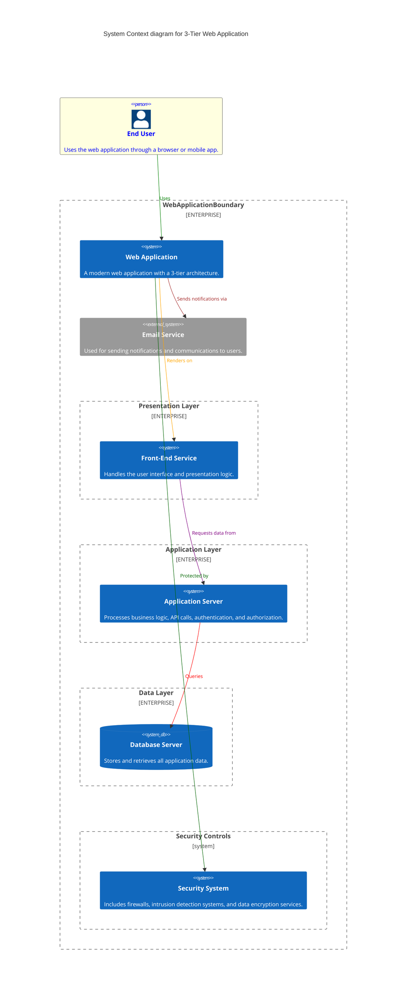

```mermaid
C4Context
  title System Context diagram for 3-Tier Web Application

  Person(user, "End User", "Uses the web application through a browser or mobile app.")
  Enterprise_Boundary(b0, "WebApplicationBoundary") {
    
    System(webApp, "Web Application", "A modern web application with a 3-tier architecture.")

    Enterprise_Boundary(b1, "Presentation Layer") {
      System(frontEnd, "Front-End Service", "Handles the user interface and presentation logic.")
    }

    Enterprise_Boundary(b2, "Application Layer") {
      System(appServer, "Application Server", "Processes business logic, API calls, authentication, and authorization.")
    }

    Enterprise_Boundary(b3, "Data Layer") {
      SystemDb(database, "Database Server", "Stores and retrieves all application data.")
    }

    System_Ext(emailService, "Email Service", "Used for sending notifications and communications to users.")

    Boundary(b4, "Security Controls") {
      System(securitySystem, "Security System", "Includes firewalls, intrusion detection systems, and data encryption services.")
    }
  }

  Rel(user, webApp, "Uses")
  Rel(webApp, frontEnd, "Renders on")
  Rel(frontEnd, appServer, "Requests data from")
  Rel(appServer, database, "Queries")
  Rel(webApp, emailService, "Sends notifications via")
  Rel(webApp, securitySystem, "Protected by")

  UpdateElementStyle(user, $fontColor="blue", $bgColor="lightyellow", $borderColor="black")
  UpdateRelStyle(user, webApp, $textColor="green", $lineColor="green")
  UpdateRelStyle(webApp, frontEnd, $textColor="orange", $lineColor="orange")
  UpdateRelStyle(frontEnd, appServer, $textColor="purple", $lineColor="purple")
  UpdateRelStyle(appServer, database, $textColor="red", $lineColor="red")
  UpdateRelStyle(webApp, emailService, $textColor="brown", $lineColor="brown")
  UpdateRelStyle(webApp, securitySystem, $textColor="darkgreen", $lineColor="darkgreen")

  UpdateLayoutConfig($c4ShapeInRow="3", $c4BoundaryInRow="1")

```
